#  End-to-End DevOps CI/CD Pipeline

A fully automated, production-grade CI/CD pipeline built using **Jenkins, Docker, Kubernetes, and Terraform**. This project demonstrates the entire lifecycle of a modern software application, moving from a code commit to a live, containerized deployment with **zero manual intervention**.

---

###  Live Demo

This animation shows the entire automated workflow: a code change is pushed to GitHub, which automatically triggers the Jenkins pipeline to build, test, and deploy the new version to the Kubernetes cluster.

%20(1).gif)
    

---
##  Table of Contents

- [Project Overview](#project-overview)
- [Architecture Diagram](#architecture-diagram)
- [Tech Stack](#tech-stack)
- [Workflow Explained](#workflow-explained)
- [Key Learning Outcomes](#key-learning-outcomes)

---

##  Project Overview

This project demonstrates a complete DevOps pipeline built using open-source tools and a free-tier setup. It mirrors the design used in modern enterprise environments but is implemented entirely on a local machine for accessibility and zero cost.

The core of the project is a **Jenkins server**, running in Docker, that listens for changes to this **GitHub repository**. Upon detecting a push, it orchestrates a series of automated actions: building a **Docker** image of a Node.js Express application, pushing it to **Docker Hub**, and then using **Terraform** to instruct a local **Kubernetes (Kind)** cluster to deploy the new version. This entire process is bridged securely from the public internet to the local environment using **ngrok**.

---

##  Architecture Diagram

The diagram below illustrates the flow of data and automation from the developer's commit to the final deployment.

```mermaid
graph TD
    A[👨‍💻 Developer] -->|1. git push| B(🌐 GitHub Repo);
    B -->|2. Webhook Trigger| C(🔗 ngrok Tunnel);
    C -->|3. Forward Webhook| D[🚢 Jenkins Server];
    subgraph Jenkins Pipeline
        D -->|4. Pulls Code| E[Stage 1: Build];
        E -->|5. Builds Image| F[🐳 Docker];
        F -->|6. Pushes Image| G(📚 Docker Hub);
        G -->|7. Runs Terraform| H[Stage 2: Deploy];
    end
    H -->|8. Applies Manifest| I[☸️ Kubernetes Cluster];
    I -->|9. Pulls New Image| G;
    J[👩‍💻 User] -->|Accesses App| I;

    style D fill:#D24939,stroke:#333,stroke-width:2px,color:#fff
    style I fill:#326CE5,stroke:#333,stroke-width:2px,color:#fff
```

---

##  Tech Stack

| Category                   | Tool / Service    | Purpose                                                   |
| -------------------------- | ----------------- | --------------------------------------------------------- |
| **CI/CD Automation**       | Jenkins           | CI/CD Automation Server                                   |
| **Containerization**       | Docker            | Containerization of the Application                       |
| **Container Registry**     | DockerHub         | Container Image Registry                                  |
| **Orchestration**          | Kubernetes (Kind) | Local Container Orchestration                             |
| **Infrastructure as Code** | Terraform         | Manages Kubernetes resources declaratively.               |
| **VCS & Webhooks**         | Git & GitHub      | Version Control and Pipeline Triggering                   |
| **Secure Tunneling**       | ngrok             | Exposes the local Jenkins webhook to the public internet. |
| **Application**            | Node.js (Express) | A lightweight web application for deployment.             |

---

##  Workflow Explained

1.  **Code Commit (GitHub):** A developer pushes new code or changes to the `main` branch of the repository.

2.  **Webhook Trigger:** A pre-configured GitHub webhook sends a notification payload over the internet to a public `ngrok` URL.

3.  **Jenkins Job Activation:** `ngrok` securely tunnels the request to the Jenkins container running on the local machine, activating the pipeline job.

4.  **Build Stage:** Jenkins checks out the latest source code and executes a Docker build command, creating a new container image based on the `Dockerfile`.

5.  **Push Stage:** Upon a successful build, Jenkins authenticates with Docker Hub and pushes the newly created image, tagging it with `latest`.

6.  **Deploy Stage:** Jenkins switches to the `terraform` directory and runs `terraform apply`. Terraform reads the desired state from the `.tf` files and makes the necessary API calls to the Kubernetes cluster to update the deployment with the new Docker image.

---

##  Key Learning Outcomes

Through this project, I gained hands-on expertise in:

-   **CI/CD Pipeline Architecture:** Building and automating multi-stage CI/CD pipelines from scratch using Jenkins.

-   **Containerization Mastery:** Managing containerized applications using Docker for builds and DockerHub for registry storage.

-   **Kubernetes Deployment:** Deploying and scaling applications on Kubernetes clusters, managing resources like Deployments and Services.

-   **Infrastructure as Code (IaC):** Using Terraform for declarative infrastructure automation, ensuring consistent and repeatable environments.

-   **System Integration:** Integrating disparate DevOps tools into a single, seamless workflow.

-   **Problem Solving:** Handling real-world DevOps challenges like Docker socket permissions, Kubernetes image pull errors, and secure credential management in pipelines.
